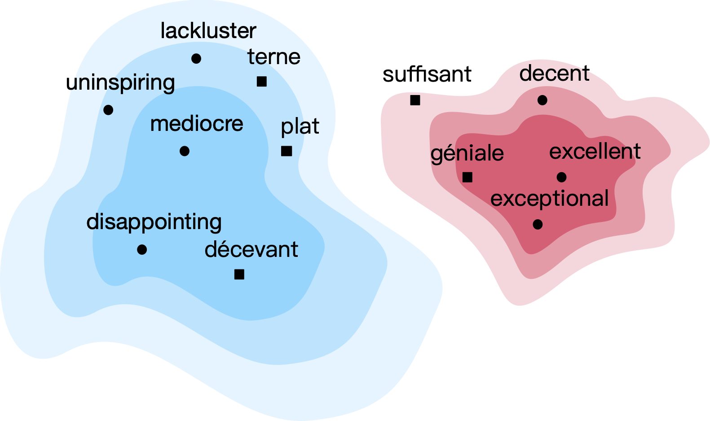

# CLIME: CLassifying Interactively with Multilingual Embeddings



CLIME is a human-in-the-loop system that improves multilingual classifiers.
Specifically, CLIME asks a bilingual user to refine pre-trianed cross-lingual word embeddings.

The following EMNLP 2020 paper describes the system:

Michelle Yuan\*, Mozhi Zhang\*, Benjamin Van Durme, Leah Findlater, Jordan Boyd-Graber. [_Interactive Refinement of Cross-Lingual Word Embeddings_](https://arxiv.org/abs/1911.03070).

If you find our code useful, please cite:

    @inproceedings{yuan-2020-clime,
        title={Interactive Refinement of Cross-Lingual Word Embeddings},
        author={Michelle Yuan and Mozhi Zhang and Benjamin Van Durme and Leah Findlater and Jordan Boyd-Graber},
        booktitle={Proceedings of Empirical Methods in Natural Language Processing},
        year={2020}
    }

In the example below, we use CLIME to refine pre-trained English-Ilocano embeddings.
We then use the refined embeddings to train a Ilocano text classifier from English labeled data.

## Install Dependencies

    pip install -r requirements.txt

## Embeddings and Labeled Data Format

To use CLIME, we first need pre-trained cross-lingual word embeddings and labeled train/test set.

There are many pre-training methods, such as [MUSE](https://github.com/facebookresearch/MUSE) and [VecMap](https://github.com/artetxem/vecmap).
We also recommend using [Iteravie Normalization](https://github.com/zhangmozhi/iternorm) and [Retrofitting](https://github.com/zhangmozhi/retrofit_clwe) as pre/post-processing steps.

For our English-Ilocano example, supppose we have the following files:
* Pre-trained English-Ilocano embeddings: `data/eng.vec` and `data/ilo.vec`
* English training set: `data/en.json`
* Ilocano test set: `data/il.json`
* Ilocano unlabeled set: `data/il_unlabeled.json`

The embedding files use the standard word2vec text format.

In the JSON files, each line is a JSON dictionary with three fields:
* `id`: an integer ID
* `text`: a list of tokenized words
* `label`: an integer label

Here is an English example:

    {
        "id": 0,
        "text": ["a", "lot", "of", "people", "suffer", "from", "the", "bird", "flu", "here"],
        "label": 1
    }
    
**Note:** Due to licensing issues, we cannot publicly release the data that we used in our paper.  If you would like to get access to our data, please email us.

## Binarize Embeddings

Before running CLIME, we need to binarize the text embedding files.

    python prepare_embeds.py data/eng.vec embeds/en
    python prepare_embeds.py data/ilo.vec embeds/il

Each output directory (`embeds/en` and `embeds/il`) has two files:
* `E.pt`: a binarized embedding matrix
* `words.json`: a dictionary maps words to a row in the matrix

## Keyword Identification

The first step in CLIME is to identify a small set of keywords for our classification task.
The keywords can be identified by training a model.
The following command trains a model on English, evaluates on Ilocano, and saves the model in `model.pt`.

    python train.py \
        --src-emb embeds/en \
        --tgt-emb embeds/il \
        --train data/en.json \
        --test data/il.json \
        --runs 1 \
        --output model.pt

The default model is a convolutional neural network. We can use other models by setting `--type` to `lr` (linear regression) or `dan` (deep averaging network).

Now we can use the model to find keywords from the English labeled dataset:

    python rank_words.py model.pt > data/word_rank.txt

The output file `data/word_rank.txt` ranks all words in the vocabulary by their importance in the classification task.

## User Interface

The second step in CLIME is annotating the similarity between keywords and their nearest neighbors.
The UI is implemented using Flask and needs to run locally.

### Preprocessing Data for Interface
We provide a sample, preprocessed data in `ui_data/example` for a task called `example`  

If you would like to preprocess your own data, please run the following command:

```
python prepare_ui.py \
    --src-emb embeds/en \
    --tgt-emb embeds/il \
    -k {number of nearest neighbors} \
    --task task \
    --rank data/word_rank.txt \
    --max {max number of keywords} \
    --src-doc data/en.json \
    --tgt-doc data/il_unlabeled.json \
    --src-f {# of most frequent words to include in src vocab} \
    --tgt-f {# of most frequent words to include in tgt vocab} \
    --src-lang ENGLISH \
    --tgt-lang ILOCANO \
    --categories data/categories.txt
```
This will preprocess the data needed for the UI in `ui_data/task`.  Note that `data/categories.txt` should contain the classification categories for the task, where each row describes a category.

### Run Interface
Run `bash clime.sh` and visit `http://127.0.0.1:5000/{task}/{user_id}` in your browser.  Replace `{task}` with the name of the task preprocessed for the UI and `{user_id}` with your chosen ID for the user (any arbitrary number).

The start page will show a set of instructions.  On the next page, you will see the UI as described in the paper.  The prompt will show the categories as listed from `data/categories.txt`.  Each page will show the keyword and its nearest neighbor in each language.  Any word on the UI can be clicked on to preview concordance.  New words can be added to the UI. 

### Database
A sqlite database keeps track of the user's progress.  When the user presses `Next` on each page, their interactions are saved in this database.  When the user presses `Finish`, all their progress is saved and their session will end.  

This database will expand as more users interact with the UI.  To reduce space on your machine, you may want to clear the database.  You can run `delete_db.sh` to clear all entries from the database.


## Update Embeddings with User Feedback

The final step in CLIME is updating the embeddings according to the user feedback.
For our English-Ilocano example, We have included a sample feedback file in `feedbacks/example_feedback.csv`.
We can update the embedding as following:

    python update.py \
        --feedback feedbacks/example_feedback.csv \
        --src-emb embeds/en \
        --tgt-emb embeds/il \
        --out-src embeds/en_new \
        --out-tgt embeds/il_new

The improved English-Sinhalese embeddings are in `embeds/en_new` and `embeds/il_new`.
We can use the new embeddings to train cross-lingual classifiers:

    python train.py \
        --src-emb embeds/en_new \
        --tgt-emb embeds/il_new \
        --train data/en.json \
        --test data/il.json

We expect this new classifier to have higher average accuracy than the classifier trained on original embeddings.

We also provide a script to convert the binarized embeddings into text format.

    python export_embeds.py embeds/en_new embeds/eng_new.vec
    python export_embeds.py embeds/il_new embeds/ilo_new.vec
